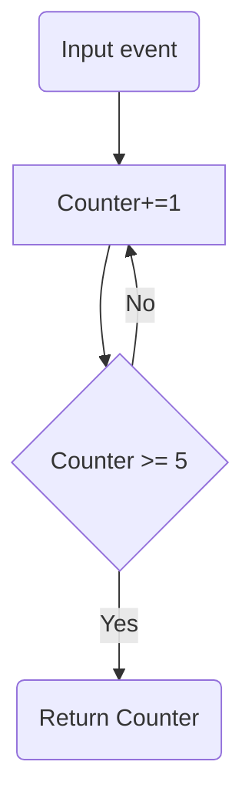

# Loops in Workflows

For many use cases, designing linear workflows might not be enough: you might need to add some quality checking, and re-execute certain steps based on the results of that, or you might want to refine the responses coming from an LLM or a RAG pipeline (e.g.) by iterating on the generation steps. 

In this sense, looping (i.e. creating cyclic workflows) can be a very useful pattern to learn when building with LlamaIndex Workflows.

Since workflows are event-driven, and every step is triggered by an event, you can go back to a specific step at any point - you just need to emit the corresponding trigger event!

This diagram might help with the visualization of the looping process:



And here is how you can do it with code:

```ts
type AgentWorkflowState = {
  counter: number = 0
  max_counter: number = 5
};

const stateful = createStatefulMiddleware((state: AgentWorkflowState) => state);
const workflow = stateful.withState(createWorkflow());

const startEvent = workflowEvent<void>();
const increaseCounterEvent = workflowEvent<void>();
const stopEvent = workflowEvent<number>();

workflow.handle([startEvent], async (context, { data }) => {
    const { sendEvent, state } = context;
    if (state.counter < state.max_counter) {
        sendEvent(increaseCounterEvent.with({}))
    } else {
        sendEvent(stopEvent.with({ state.counter }))
    }
})

workflow.handle([increaseCounterEvent], async (context, { data }) => {
    const { sendEvent, state } = context;
    state.counter += 1
    sendEvent(startEvent.with({}))
})

const { stream, sendEvent } = workflow.createContext({
  counter: 0,
  max_counter: 5,
});

sendEvent(
    startEvent.with({}),
);

const result = await stream.until(stopEvent).toArray();
console.log(result[result.length - 1].data)
```

